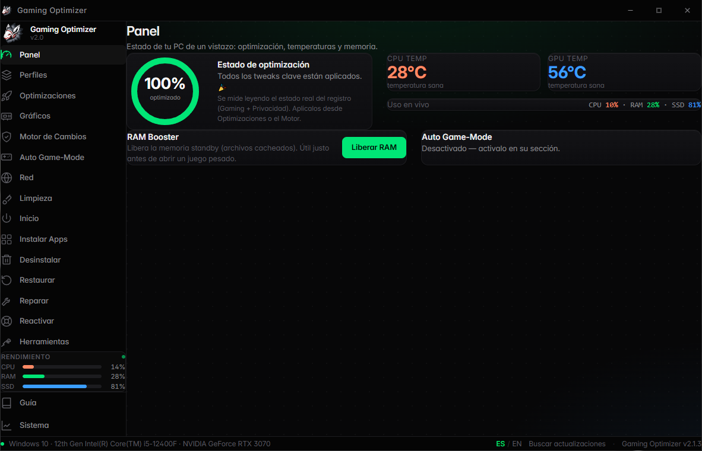
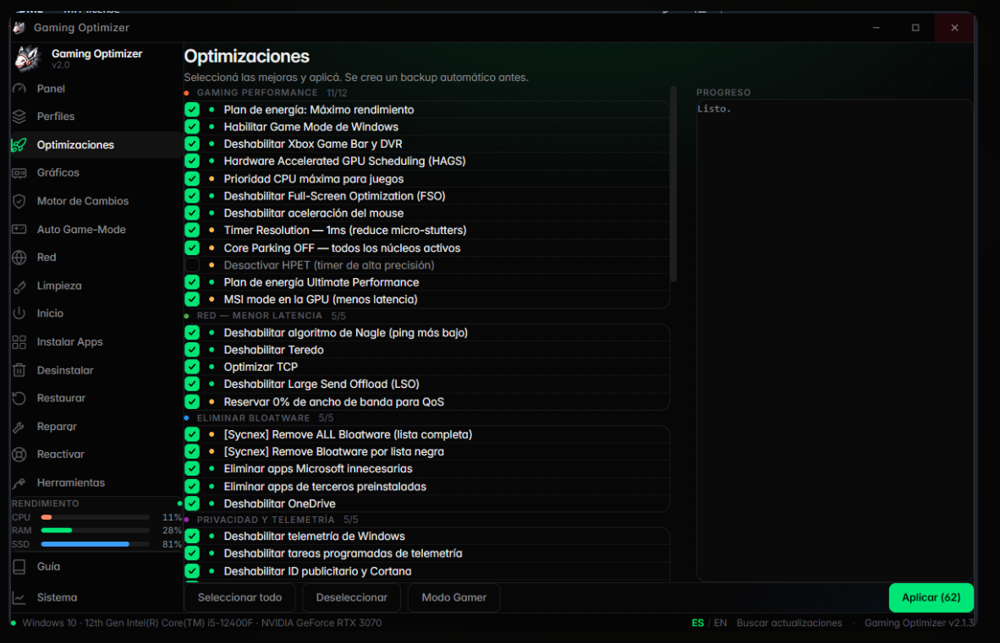
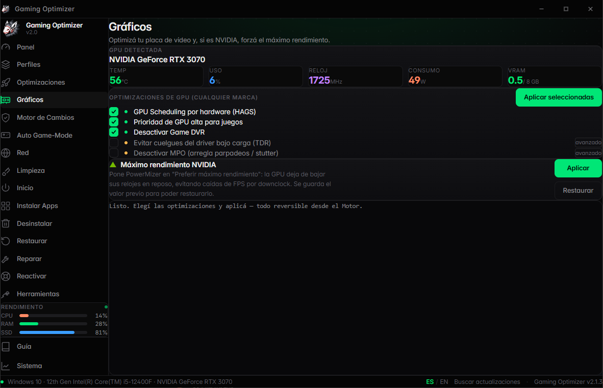
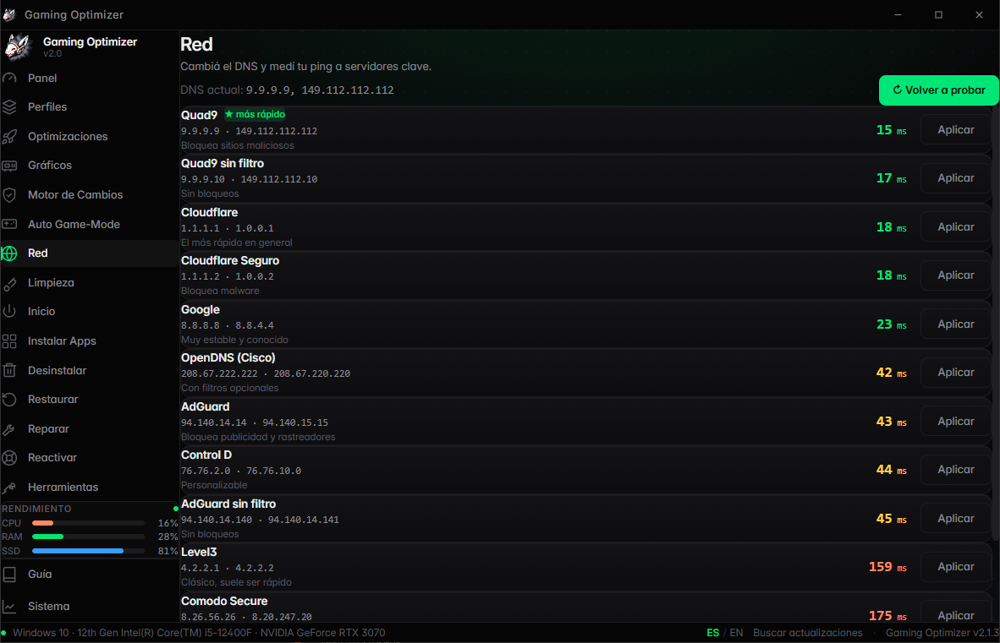
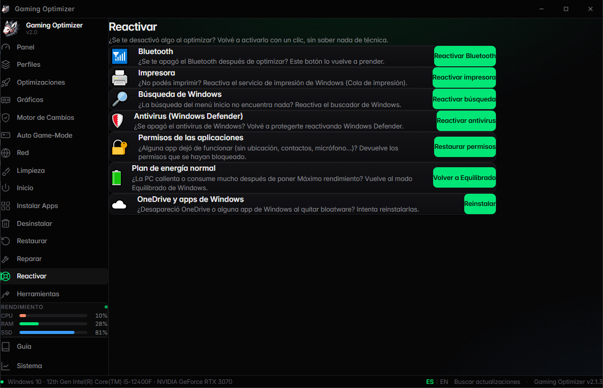

<div align="center">

# 🐺 Gaming Optimizer

**Optimizador de Windows para gaming** — rápido, **reversible** y con un diseño minimalista.


<br>


</div>

---

## ⬇️ Descargar

Bajá el instalador desde la sección [**Releases**](https://github.com/Pana1245/gaming-optimizer/releases/latest) →
`GamingOptimizer_x64-setup.exe`.

> **SmartScreen** puede avisar *"Windows protegió tu PC"* porque el instalador está auto-firmado.
> Elegí **"Más información" → "Ejecutar de todas formas"**. Una vez instalado, se **auto-actualiza** solo.

---

## ✨ Características

| Sección | Qué hace |
|---|---|
| 📊 **Panel** | Dashboard con anillos CPU/RAM, puntaje de optimización, temperaturas y **RAM Booster** (baja el uso de RAM de verdad: working sets + caché + standby). |
| 🎯 **Perfiles** | Configuraciones completas con un clic (Competitivo, Streaming, Equilibrado, Ahorro). Todo reversible. |
| 🚀 **Optimizaciones** | +60 tweaks de rendimiento, red y privacidad. Backup + punto de restauración automático. Etiquetas de riesgo 🟢/🟡. |
| 🖥️ **Gráficos** | Tweaks universales de GPU + máximo rendimiento NVIDIA/AMD y monitor en vivo por `nvidia-smi`. |
| 🛡️ **Motor de Cambios** | Aplica tweaks **leyendo el valor previo, verificando que quedó, y con historial para deshacer uno por uno**. Auditado y reversible. |
| 🎮 **Auto Game-Mode** | Un daemon detecta cuándo abrís un juego, activa el modo gamer y **revierte solo** al cerrarlo. |
| 🌐 **Red** | Test de latencia + cambio de DNS (lista curada de resolutores públicos). |
| 🧹 **Limpieza** | Analiza y libera espacio (temporales, cachés, papelera…). Muestra los MB liberados. |
| ⏻ **Inicio** | Gestor de programas de arranque con interruptores (no destructivo). |
| 📦 **Instalar Apps** | ~97 apps vía `winget` — **instalación forzosa** que evita el bug de la Microsoft Store, con reintento. |
| 🗑️ **Desinstalar** | Quita programas + **Force Removal** de restos (estilo Geek Uninstaller). Quita bloatware. |
| ↩️ **Restaurar** | Restaura backups del registro y puntos de restauración. |
| 🔧 **Reparar** | SFC, DISM (salida **en vivo**), reset de red, reiniciar Explorer. |
| 🛟 **Reactivar** | Para el usuario **no técnico**: vuelve a activar con un clic lo que se haya desactivado — Bluetooth, permisos de apps, impresora, búsqueda, antivirus, plan de energía, OneDrive. |
| 🔧 **Herramientas** | Control de Windows Update + desbloqueo de archivos en uso (Restart Manager). |
| 📊 **Sistema** | Monitor CPU/RAM/SSD en tiempo real + info de hardware. |

Además: **auto-actualización** (con botón manual "Buscar actualizaciones"), **notificaciones**, **idioma ES/EN**, barra de título custom y guía integrada.

---

## 📸 Capturas

<div align="center">
  
</div>

<table>
  <tr>
    <td width="50%"><p align="center"><b>Optimizaciones</b></p></td>
    <td width="50%"><p align="center"><b>Gráficos · GPU</b></p></td>
  </tr>
  <tr>
    <td width="50%"><p align="center"><b>Red · DNS</b></p></td>
    <td width="50%"><p align="center"><b>Reactivar 🛟</b></p></td>
  </tr>
</table>

---

## 🛠️ Stack

- **Frontend:** React + TypeScript + Tailwind CSS v4 + Framer Motion
- **Backend:** Rust (Tauri v2)
- **Tamaño:** ~5 MB de instalador · usa el WebView2 del sistema (no empaqueta navegador)

## 🚀 Build desde el código

```bash
# Requisitos: Node.js, Rust (rustup) y las build tools de MSVC
npm install
npm run tauri build
```

El instalador queda en `src-tauri/target/release/bundle/nsis/`.

## 🔄 Auto-actualización

La app consulta las **Releases** de este repo y se actualiza sola (o con el botón **Buscar actualizaciones** de la barra inferior). Cada versión publica tres assets: `*-setup.exe`, `*-setup.exe.sig` y `latest.json`.

---

## 🔏 Firma de código · Code Signing

Windows code signing for **Gaming Optimizer** is provided free of charge by
[**SignPath.io**](https://about.signpath.io/), with a free code signing certificate
from the [**SignPath Foundation**](https://signpath.org/).

> Gaming Optimizer usa el programa de firma gratuita de la **SignPath Foundation** para
> firmar sus instaladores. Hasta que la firma esté activa en cada release, SmartScreen puede
> seguir avisando (ver arriba).

---

## 🙏 Créditos

Algunos tweaks de la categoría **"Más Tweaks · WinUtil"** fueron adaptados de
[**WinUtil**](https://github.com/ChrisTitusTech/winutil) de **Chris Titus Tech** (licencia MIT).
Ver [`CREDITS.md`](CREDITS.md).

## ⚠️ Aviso

Esta herramienta modifica ajustes del sistema (registro, servicios, etc.) y requiere permisos de
administrador. Aunque crea backups automáticos y casi todo es reversible (Motor + sección Reactivar),
algunos tweaks marcados como avanzados 🟡 son agresivos — **usala bajo tu responsabilidad**.

## 🔒 Privacidad

Gaming Optimizer **no recolecta ni transmite ningún dato personal** — todo corre localmente en tu
PC. Ver [`PRIVACY.md`](PRIVACY.md).

## 📄 Licencia

MIT © Dani Dev — ver [`LICENSE`](LICENSE).
